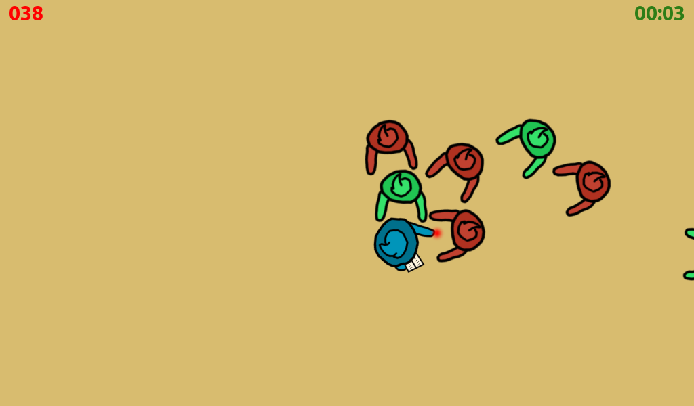

# Duof

Ability game made for [Ludum Dare #43](https://ldjam.com/events/ludum-dare/43)

## About

The world of magicians is suffering a zombies apocalypse!

Help the great magician Duof (*) to survive as long as you can by fighting back hordes of zombies trying to drain your life (red magicians) or your time (green ones).

Use your spells book to defend yourself, but be aware: spells will cost you your life / time as well! 

One last note: healing powerups will randomly appear on the map,  so keep moving and look for them!

(*) From "Du oferoj" ("Two sacrifices", in Esperanto)

## Controls

* W, A, S, D: move
* Mouse move: aim
* Mouse left button: shoot
* Spacebar: swap ammo type (life / time)

## Links

- [Duof page at Ludum Dare #43 webpage](https://ldjam.com/events/ludum-dare/43/duof)
- [Play online Duof v1.0.0 - HTML5](http://moisesjbc.github.io/games/duof/)
- [Download Duof v1.0.0 for Linux](https://github.com/moisesjbc/ludum-dare-43/releases/download/v1.0.0/duof_linux_v1_0_0.zip)
- [Download Duof v1.0.0 for Windows](https://github.com/moisesjbc/ludum-dare-43/releases/download/v1.0.0/duof_windows_v1_0_0.zip)
- [Download Duof v1.0.0 for Browser](https://github.com/moisesjbc/ludum-dare-43/releases/download/v1.0.0/duof_html_v1_0_0.zip)

## Bugs videos!

- Setting shoots local to player node was a bad idea: [Video - "local shoots" bug](multimedia/video/local_shoots)
- 4 shoots are better than one: [Video - 4 "shoots are better" bug](multimedia/video/4_shoots_are_better)

## Credits

### Idea, programming, graphics and sound

Moisés J. Bonilla Caraballo - [webpage](www.moisesjose.com)

### Third party work and tools used

#### Software

* Godot Engine (https://godotengine.org/)
* Gimp (https://www.gimp.org/)
* Audacity (https://www.audacityteam.org/)

#### Fonts

* Ubuntu-B.ttf (https://design.ubuntu.com/font/)

## Build new version (from Linux)

1. Make changes
2. Change version number in game title (Project configuration in Godot)
3. Run `export.sh` script (replace `[version_string]` - ie. v1.0.0)

        bash export.sh duof [version_string]

4. Upload
5. Enjoy!
